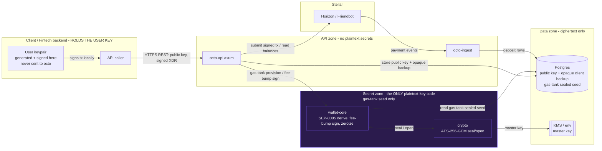
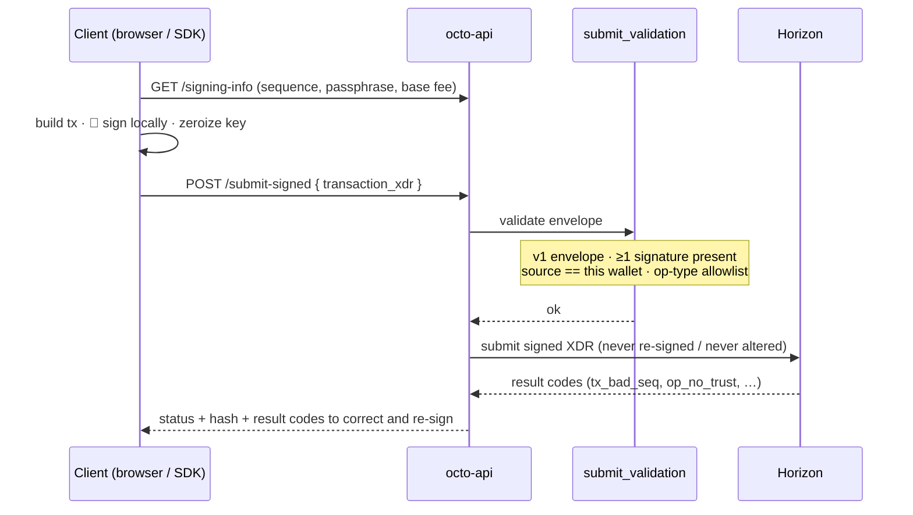

<div align="center">


# octo

**Stellar-native master-wallet infrastructure** — Wallet-as-a-Service for stablecoins.

[](https://github.com/Octo-Protocol-org/Octo-Protocol/actions/workflows/ci.yml)
[](./LICENSE)

</div>

octo lets a fintech manage stablecoin deposits on Stellar from a **single master wallet**:
generate a dedicated deposit address per customer, detect deposits in real time, and relay
client-signed withdrawals — all behind a REST API with signed webhooks, and a genuinely
**non-custodial** key model (keys are generated and held client-side; the server never sees them).

It replicates the "master wallet" backbone of platforms like Blockradar, but built **Stellar-first**.

## Why this is simple on Stellar: muxed accounts

Instead of deploying a funded on-chain account per customer (and sweeping funds back), octo
uses **muxed accounts** (`M...`): one real account (`G...`) plus a per-customer 64-bit id encoded
into the address. Deposits to a customer's `M...` land directly in the master account and carry
the id, so:

- **no auto-sweep** — funds are already in the master,
- **no per-user XLM reserve** — only one account exists on-chain,
- **generating an address is free and off-chain** — just assign the next id.

For senders that don't yet accept `M...` (e.g. some exchanges), octo also exposes the
equivalent **`G...` + numeric memo** form, and attributes deposits by **muxed id _or_ memo id**.
See [docs/deposit-model.md](docs/deposit-model.md).

## Architecture

A Cargo workspace; all secret-handling is isolated in `wallet-core` and zeroized after signing.

| Crate | Responsibility |
|---|---|
| [`crates/crypto`](crates/crypto) | AES-256-GCM seal/open of the HD seed (random nonce + salt) |
| [`crates/wallet-core`](crates/wallet-core) | SEP-0005 ed25519 derivation, muxed encode/decode, tx sign + `zeroize` |
| [`crates/store`](crates/store) | Postgres models + migrations (sqlx) |
| [`crates/webhooks`](crates/webhooks) | HMAC-SHA256 signed outbound webhooks + delivery log |
| [`crates/ingest`](crates/ingest) | Horizon payment streaming + durable cursor → deposit detection |
| [`crates/api`](crates/api) | axum REST API |
| [`bin/server`](bin/server) | composes `api` + `ingest` into one service |

See [docs/architecture.md](docs/architecture.md).

## Quickstart

```bash
# 1. Tooling: Rust 1.84.1 (pinned via rust-toolchain.toml), Docker, just
cp .env.example .env                 # then fill MASTER_KEY (openssl rand -base64 32)

# 2. Local Postgres
docker compose up -d db

# 3. Build & test
just build
just test

# 4. Run the service (REST API + deposit ingest worker)
just run            # cargo run -p octo-server  → API on $BIND_ADDR (default :8080)
```

Then, against a running server (testnet):

All routes below require a dashboard login token (`Authorization: Bearer <JWT>` from
`POST /v1/auth/signup`); `$TOKEN` stands in for it.

```bash
# Create a master wallet. Non-custodial: YOU generate the keypair (browser/SDK) and register
# only the public account — the server never receives the private key or mnemonic.
# `encrypted_backup` is optional and opaque to the server (client-encrypted under your password).
curl -s -X POST localhost:8080/v1/wallets \
  -H "authorization: Bearer $TOKEN" -H 'content-type: application/json' \
  -d '{"public_key":"G...YOURS","label":"acme"}' | jq

# Generate a customer deposit address (returns the M... and the G...+memo fallback)
curl -s -X POST localhost:8080/v1/wallets/<WALLET_ID>/addresses \
  -H "authorization: Bearer $TOKEN" | jq

# Live on-chain balances
curl -s localhost:8080/v1/wallets/<WALLET_ID>/balances \
  -H "authorization: Bearer $TOKEN" | jq

# Register a webhook
curl -s -X POST localhost:8080/v1/wallets/<WALLET_ID>/webhooks \
  -H "authorization: Bearer $TOKEN" -H 'content-type: application/json' \
  -d '{"url":"https://your.app/hooks"}' | jq

# Move funds: fetch what you need to build the transaction, sign it LOCALLY, then relay it.
# (POST /withdraw is gone — 410 — because the server holds no key to sign with.)
curl -s localhost:8080/v1/wallets/<WALLET_ID>/signing-info \
  -H "authorization: Bearer $TOKEN" | jq   # sequence, network passphrase, base fee
curl -s -X POST localhost:8080/v1/wallets/<WALLET_ID>/submit-signed \
  -H "authorization: Bearer $TOKEN" -H 'content-type: application/json' \
  -d '{"transaction_xdr":"<BASE64_SIGNED_XDR>"}' | jq
```

See [docs/non-custodial-flow.md](docs/non-custodial-flow.md) for the full
build → sign → relay sequence.

## Security architecture

octo is non-custodial: user wallet keys are generated and held **client-side** (browser/SDK), so
the server has nothing to sign with and a full server compromise cannot move user funds. The real
surface is therefore the **submit path** — validating client-signed transactions before relaying
them — plus the one remaining server-held key: each wallet's optional **gas tank**, a fee-only
account whose seed is encrypted at rest and only ever decrypted in memory, inside one crate, for
the instant it takes to sign a fee-bump — then wiped. Its worst-case exposure is bounded by the
gas budget, never customer balances.

### Trust boundaries — where secrets live

The **user's** private key never enters this diagram at all — it is generated and used entirely
client-side. Server-side, the only plaintext key material is a wallet's optional **gas tank**
seed, confined to the **secret zone** (`wallet-core` + `crypto`). The HTTP layer, database, and
network never see a decrypted seed or a private key.



### The submit path (per transaction)

The user's key is used **on the client**; octo only validates and relays what arrives. There is
no server-side signing step for user funds to attack, and no "sign anything" oracle, because the
server has no user key to sign with.



Fee-bump sponsorship is the one place octo still signs — with the wallet's **gas-tank** key, over
the *outer* fee-bump envelope only. The user's inner transaction is passed through untouched.

### Defense summary

| Attack class | Defense in octo |
|---|---|
| **Full server compromise** | The user's key is **never on the server** — DB, backups and RAM all lack it, so an attacker with total server control still cannot move user funds |
| Stolen key backup | `encrypted_backup` is ciphertext the **client** produced under the user's password; octo stores it opaquely and cannot decrypt it |
| Gas-tank seed stolen from DB / backup | Stored **AES-256-GCM** (random nonce+salt); master key from **KMS/env**, never in the DB. Exposure is bounded by the **gas budget**, never customer balances |
| Seed/key leaked via logs or panic | Secrets confined to `wallet-core`/`crypto`, wrapped in `Zeroizing`, no `Debug`; `unwrap`/`panic` **denied** by clippy there |
| Signing-oracle abuse | No user key server-side, so there is nothing to coerce into signing. Relayed transactions are **validated, never re-signed or altered** (v1 envelope, signature present, source == wallet, op-type allowlist) |
| Fee-bump abuse (sponsorship) | The gas tank signs only the **outer** fee-bump; the inner tx is untouched. Per-tx fee cap + daily budget, reserved atomically under a per-wallet lock |
| Deposit double-credit (reorg/replay) | Credited only on `successful==true`, **idempotent** on the immutable `(tx_hash, op_index)` unique index |
| Wrong-network signature | Network bound as **AES-GCM AAD** — a testnet-sealed gas-tank seed can't be opened as mainnet |
| Session/token replay | Tokens carry a unique `jti`; logout and refresh both **deny-list** the presented token, checked on every authenticated request |
| SSRF via webhook URL | `is_safe_url` rejects loopback/private/link-local targets, IPv4 **and** bracketed IPv6 |
| SQL injection | Parameterized `sqlx` only |
| Supply chain | `cargo-deny` + `cargo-audit` + `gitleaks` + pinned `Cargo.lock` in CI |

Full mapping in **[docs/threat-model.md](docs/threat-model.md)**. Amounts are integer **stroops**
end-to-end (never floats). Report vulnerabilities per **[SECURITY.md](SECURITY.md)** — **do not**
open public issues for security reports.

## Roadmap

- **Gas sponsorship** — *shipped.* App developers can sponsor their users' Stellar transactions
  via fee-bump from a per-wallet **gas tank**, so users transact without holding XLM for fees.
  Per-transaction fee caps and a daily budget are enforced atomically.
  See `POST /v1/wallets/:id/gas-tank` and `POST /v1/wallets/:id/sponsor`.
- Fiat on/off-ramp and additional chains.

> The "MPC/HSM custody upgrade" that used to sit here is no longer on the roadmap: it was a plan
> to better protect a server-held user key, and the non-custodial cutover removed that key
> entirely. MPC/HSM remains relevant only to the gas-tank fee key, whose exposure is already
> bounded by the gas budget.

## Status

Early development — built step by step. See the workspace crates for what's implemented.

## License

MIT — see [LICENSE](LICENSE).
