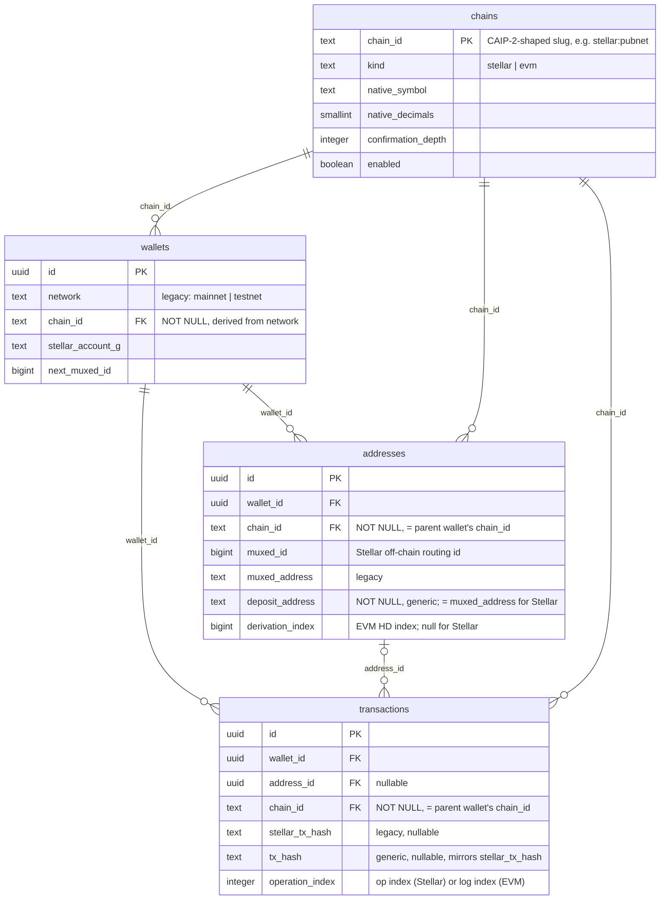

# Architecture

octo is a Cargo workspace. The guiding rule: **secret material is confined to one crate**
(`wallet-core`), decrypted only in-memory at signing time, and zeroized immediately after.

## Crates

```
crates/
  crypto/       AES-256-GCM seal/open of a gas-tank seed (random nonce + salt). No Stellar knowledge.
  wallet-core/  The only code that touches secret keys (server-side: gas tank only):
                  - SEP-0005 (SLIP-0010 ed25519) derivation: m/44'/148'/<index>'
                  - muxed address (M...) encode/decode
                  - build + sign fee-bump envelopes, then zeroize
  resilience/   Retry with backoff + circuit breaker for outbound Horizon calls.
  store/        Postgres models + migrations (sqlx).
  webhooks/     HMAC-SHA256 signed outbound webhooks with retry + delivery log.
  ingest/       Horizon payment streaming + durable cursor → deposit detection & attribution.
  api/          axum REST API (wallets, addresses, submit-signed, sponsorship, webhooks).
bin/
  server/       Composes api + ingest into one process (splittable later to scale).
  migrate-keys/ Offline backfill that re-seals gas-tank seeds under a new master key
                (zero-downtime rotation; skips client-custody rows, which hold no seed).
```

## Request flows

### Create master wallet (non-custodial)
The **client** generates the BIP39 mnemonic and derives the base keypair (`m/44'/148'/0'`) in the
browser/SDK. It sends `api` only the public account (`G...`), plus an optional `encrypted_backup`
blob it encrypted under the user's password. `store` persists the public key, the opaque blob and
`custody = 'client'` — **no seed, no mnemonic, ever.** On testnet, friendbot funds the account so
it exists on-chain.

### Generate a customer address
`api` atomically increments the wallet's id counter → `wallet-core` encodes a muxed `M...` from
the base `G...` + id → `store` saves the row. **No on-chain operation.** The response also returns
the `G...` + numeric-memo fallback for senders that don't support muxed.

### Detect a deposit
`ingest` streams the master account's payments from Horizon (with a persisted cursor). Each
payment is attributed to a customer by its **muxed id** or **memo id**, recorded as a `deposit`
transaction, and a signed webhook fires.

For the full contract around cursor resume, dedup, reorg handling, and the quarantine path
see [`docs/ingest-integration.md`](ingest-integration.md).

### Move funds out (client-signed)
The client fetches `GET /signing-info` (sequence, network passphrase, base fee), builds and
**signs the transaction locally**, then relays it via `POST /submit-signed`. `api` validates the
envelope and submits it to Horizon **unmodified** → record + webhook on confirmation. Horizon's
result codes are passed back so the client can correct and re-sign.

The custodial `POST /withdraw` and `POST /trustlines` endpoints are `410 Gone` tombstones.

## Signing safety

The user's key is never on the server, so there is no server-side signing path for user funds —
and therefore no signing oracle to abuse. What `api` does on the submit path is *validate*:

1. Envelope is a v1 `Tx` (not a fee-bump wrapper smuggled in).
2. At least one signature is present.
3. The source account **is this wallet**.
4. Every operation is on the allowlist (payment / path-payment / change-trust).
5. Submit verbatim — the server never re-signs or alters the transaction.

### The one server-held key: the gas tank
Fee sponsorship still needs a server signature, so a wallet may provision a **gas tank**: a
separate account holding fee float only. Its seed is the only plaintext key material on the
server, and it is confined to one crate:

1. Retrieve the encrypted gas-tank seed from `store`.
2. `crypto::open` decrypts in-memory (AES-256-GCM; tag verifies integrity, network bound as AAD).
3. `wallet-core` derives the private key via SEP-0005.
4. Sign **only the outer fee-bump envelope** — the user's inner transaction is untouched.
5. `zeroize` the seed and key buffers.

Keys are never written to disk or logs and are never persisted in derived form. Worst-case
exposure of this key is the gas budget — never customer balances.

## Data model: multi-chain (#214)

The schema used to hard-code Stellar into column names, constraints, and unique indexes —
`wallets.network CHECK (network IN ('mainnet','testnet'))` had no chain dimension at all, and the
anti-double-credit guard was `UNIQUE(stellar_tx_hash, operation_index)` with no chain scoping,
which silently assumed a tx hash is globally unique (true for one Stellar network, false once a
second chain exists). `migrations/0021_chains_registry.sql` onward generalizes this to a `chains`
registry plus a `chain_id` column threaded through `wallets`, `addresses`, and `transactions`.



### Backward-compatibility strategy: additive columns, not a rename

Renaming `stellar_tx_hash` → `tx_hash` (etc.) in place would break the currently-running old
binary mid-deploy — it still selects/binds the old column name. The two ways to avoid that are (a)
rename across two releases behind a compatibility view/generated column, or (b) keep every legacy
column and add generic ones alongside, backfilled from the legacy ones. This migration takes **(b)**:
`network`/`stellar_tx_hash`/`muxed_address` all still exist; `chain_id`/`tx_hash`/`deposit_address`
are new columns kept in lockstep by every `Store` write path (see
`octo_store::stellar_chain_id_for_network`). This was chosen over (a) because a view/generated-column
indirection adds a layer that complicates `SELECT *` / `RETURNING *` (what `sqlx::FromRow` relies on
throughout this crate) for comparatively little benefit at this schema's size, and because keeping
both names live is simpler to reason about during the transition than sequencing two coordinated
releases. The cost is some duplicated data (`tx_hash` == `stellar_tx_hash` for every Stellar row
today) — acceptable for a schema still under active expansion; a future cleanup migration can drop
the legacy columns once every caller has moved off `network`/`stellar_tx_hash`/`muxed_address` (that
work belongs to the `octo-chain` adapter rollout, #213/#215/#220/#223, not this migration).

### Migration shape: additive → backfill → validate → enforce → swap indexes

Every step is designed to avoid a long `ACCESS EXCLUSIVE` lock on `transactions` and to never let
the anti-double-credit invariant lapse:

1. **Additive** (`0021`-`0022`): create `chains`, seeded with the two existing Stellar networks;
   add every new column as nullable with no default (fast, metadata-only on PG11+).
2. **Backfill** (`0023`-`0025`): `wallets` (small) backfills in one `UPDATE`; `addresses` and
   `transactions` backfill in batches of 5,000 rows, each batch committed independently (these
   migration files are marked `-- no-transaction` specifically so a bare `COMMIT` inside the
   backfill loop is legal) — no single transaction holds locks or accumulates WAL for the whole
   table, and the loop resumes from the first still-`NULL` row if interrupted.
3. **Validate** (`0026`-`0028`): `chain_id`/`deposit_address` NOT NULL is added as `CHECK (...)
   NOT VALID` (instant), validated in a separate migration/transaction under a lock that doesn't
   block reads/writes (`VALIDATE CONSTRAINT`), then promoted to real `NOT NULL` — which, on
   PG12+, reuses the now-validated CHECK to skip its own table scan.
4. **New indexes, built `CONCURRENTLY`** (`0029`-`0032`): including `uq_tx_onchain_chain` on
   `(chain_id, tx_hash, operation_index)` — the re-scoped anti-double-credit guard — and
   `uq_addresses_chain_deposit` on `(chain_id, deposit_address)` (generalizing the old
   `UNIQUE(muxed_address)`, which is wrong for EVM: a deposit address is only unique *within* a
   chain).
5. **Drop the legacy index** (`0033`), `DROP INDEX CONCURRENTLY`, only once `uq_tx_onchain_chain`
   is confirmed built — so the anti-double-credit guarantee is never unenforced, even briefly:
   the new chain-scoped index is live before the old global one goes away.

**Caveat for real multi-replica deploys:** `CREATE INDEX CONCURRENTLY` and `VALIDATE CONSTRAINT`
each wait for every other in-flight transaction on the server to finish, including one that's
merely blocked acquiring sqlx's own migration advisory lock — so two processes calling
`store.migrate()` at the same moment while one of these migrations is pending can deadlock
(`octo_store::Store::migrate` serializes same-process callers against this, which is what a
parallel `cargo test` run exercises, but it cannot serialize across independent OS processes).
Apply this migration set once (`just migrate`) before rolling out new `bin/server` replicas,
rather than relying on every replica's own boot-time `store.migrate()` call to race it out.
