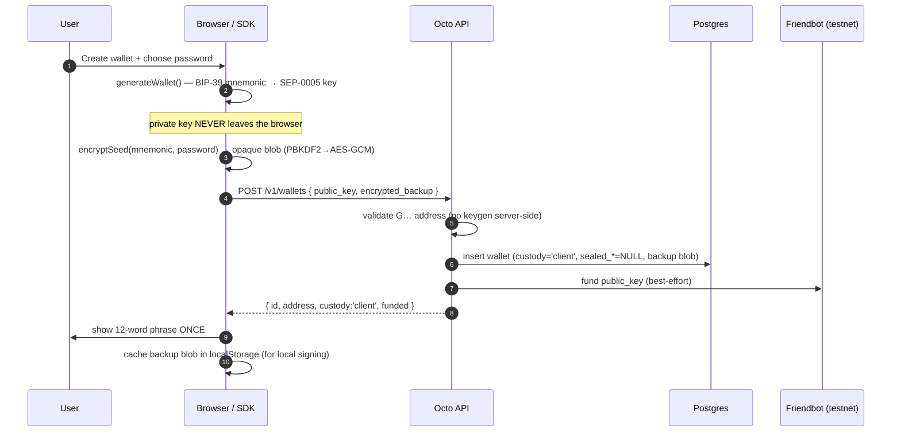
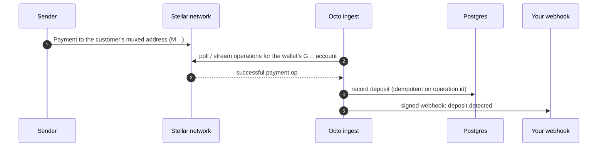
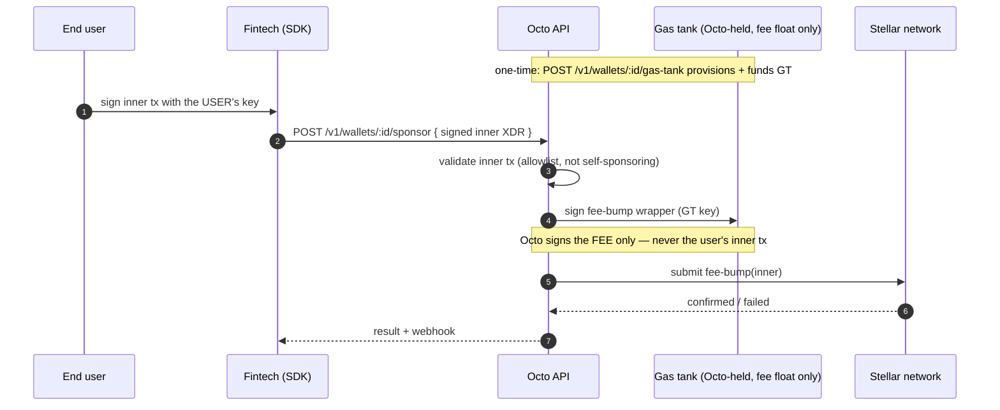
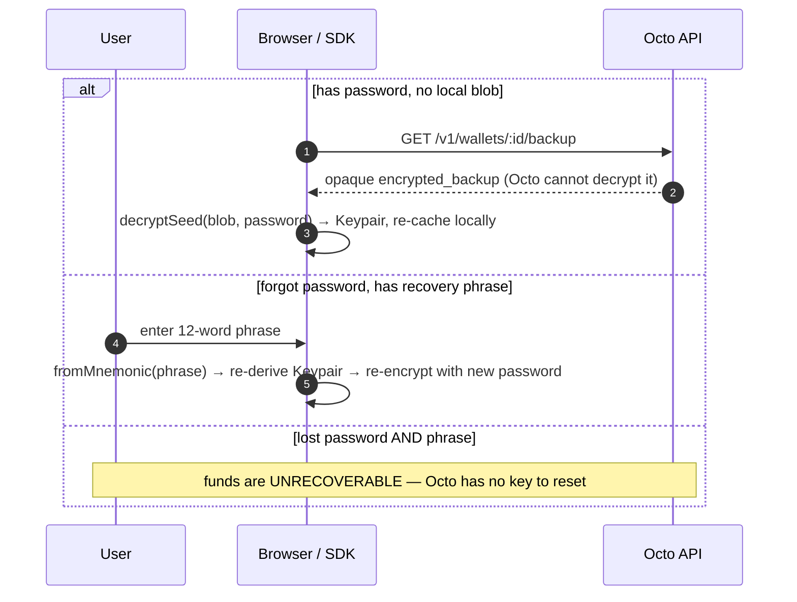

# Non-custodial architecture & flows

Octo is **non-custodial**: a user wallet's private key is generated in the client (browser/SDK),
never transmitted to Octo, and never stored on our servers. The server can build nothing that
moves user funds — every transaction touching a balance is signed on the user's device. Octo
validates the signed transaction and relays it.

The only server-held key is a per-wallet **gas tank**: a separate account that holds fee float
only, used to sponsor fees via fee-bump. Its worst-case exposure is the gas budget, never
customer balances.


- Client key handling / signing: `src/lib/sdk/` (frontend)
- Submit + validation: `crates/api/src/routes/submit.rs`, `crates/api/src/submit_validation.rs`
- Wallet creation / backup / gas tank: `crates/api/src/routes/wallets.rs`
- Custodial endpoints (`/withdraw`, `/trustlines`) now return **410 Gone**.

---

## What changed vs. the old custodial model

| | Before (custodial) | After (non-custodial) |
|---|---|---|
| Key generation | Octo server | Client (browser/SDK) |
| Seed storage | Encrypted in Octo's DB | Client device + opaque password-encrypted backup Octo can't decrypt |
| Who signs a withdrawal | Octo's server | The user, locally |
| Withdraw request body | `destination` + `amount` (server signs) | A fully **signed transaction (XDR)** (server relays) |
| Full server breach | Can drain every wallet | Cannot move funds — no keys to steal |
| `POST /withdraw`, `POST /trustlines` | Server-signs | **410 Gone** → `POST /submit-signed` |
| Gas sponsorship | Fee-bump from the wallet's own seed | Fee-bump from a separate gas tank (fee float only) |
| Lost password **and** phrase | Octo could reset | Unrecoverable (the non-custodial trade-off) |
| Deposits / addresses / balances | — | Unchanged (never needed a key) |

---

## 1. Wallet creation — the key is born on the device



Result: the DB row has **no seed** for the user account. The stored `encrypted_backup` is
ciphertext only the user's password can open — Octo can't decrypt it.

---

## 2. Deposit — unchanged, no key involved



Deposits, addresses, balances, and webhooks require only the **public** account — the private key
plays no part, so this path is identical to before.

---

## 3. Withdrawal / trustline — the user signs, Octo relays

This is the core of the change. Octo receives an **already-signed** transaction and cannot alter
it (any tamper breaks the signature; Horizon rejects it).

```mermaid
sequenceDiagram
    autonumber
    participant U as User
    participant B as Browser / SDK
    participant API as Octo API
    participant N as Stellar network

    U->>B: destination + amount + WALLET PASSWORD
    B->>B: unlockWallet(password) → decrypt backup → Keypair (in memory only)
    B->>API: GET /v1/wallets/:id/signing-info
    API->>N: fetch account sequence number
    API-->>B: { sequence, network_passphrase, base_fee }
    B->>B: buildSignedPayment(keypair, info, …) → SIGN locally → XDR
    Note over B: signature created on-device; key never sent
    B->>API: POST /v1/wallets/:id/submit-signed { transaction_xdr }
    API->>API: validate (v1 envelope, ≥1 signature, source==wallet, op allowlist)
    Note over API: Octo NEVER signs here — it only validates
    API->>N: submit signed XDR
    N-->>API: confirmed / failed (+ result codes)
    API->>API: record transaction in history
    API-->>B: { status, stellar_tx_hash, detail? }
    B->>U: result + explorer link
```

Trustlines (e.g. adding USDC) follow the same shape with `buildSignedChangeTrust` instead of
`buildSignedPayment`.

---

## 4. Gas sponsorship — the one server-held key, and why it's safe

A fintech can let *their* users transact without holding XLM. Octo signs **only the fee-bump
wrapper**, using a per-wallet gas tank it provisions and holds. The user still signs the inner
transaction with their own key.



If the gas-tank key ever leaked, the loss is bounded by the gas budget — customer balances are
never signable by Octo.

---

## 5. Recovery — new device / cleared browser



---

## The guarantee, in one line

The private key lives in the user's browser, not Octo's database — so "withdraw" changed from
*"tell Octo to sign and send"* to *"sign it yourself and hand Octo the signed transaction to
relay,"* which is precisely why a full compromise of Octo can no longer move user funds.

Empirically verified: across all `custody='client'` wallets, **zero** store any user seed; and a
browser-signed payment plus a gas-tank-sponsored fee-bump were both confirmed live on Stellar
testnet.
